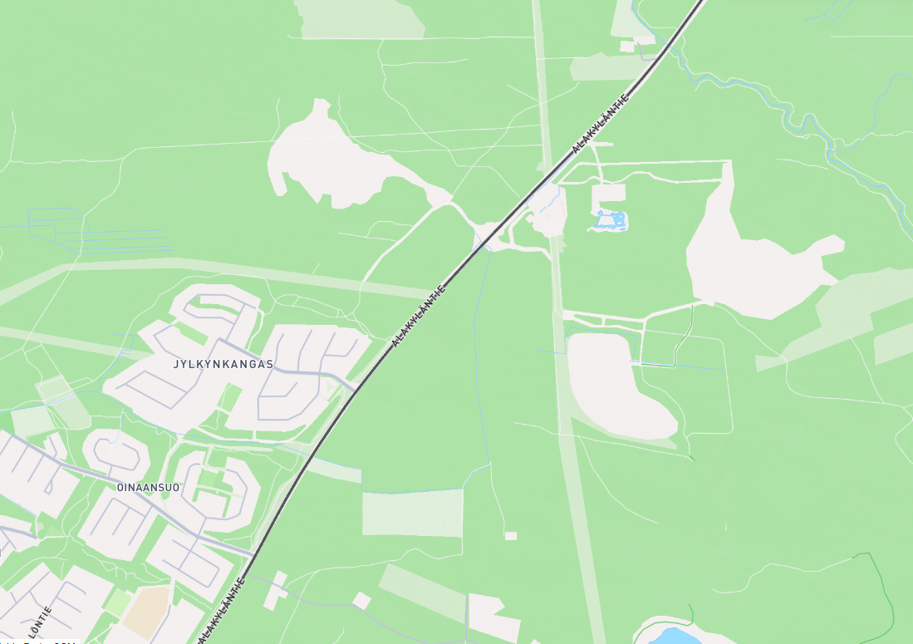
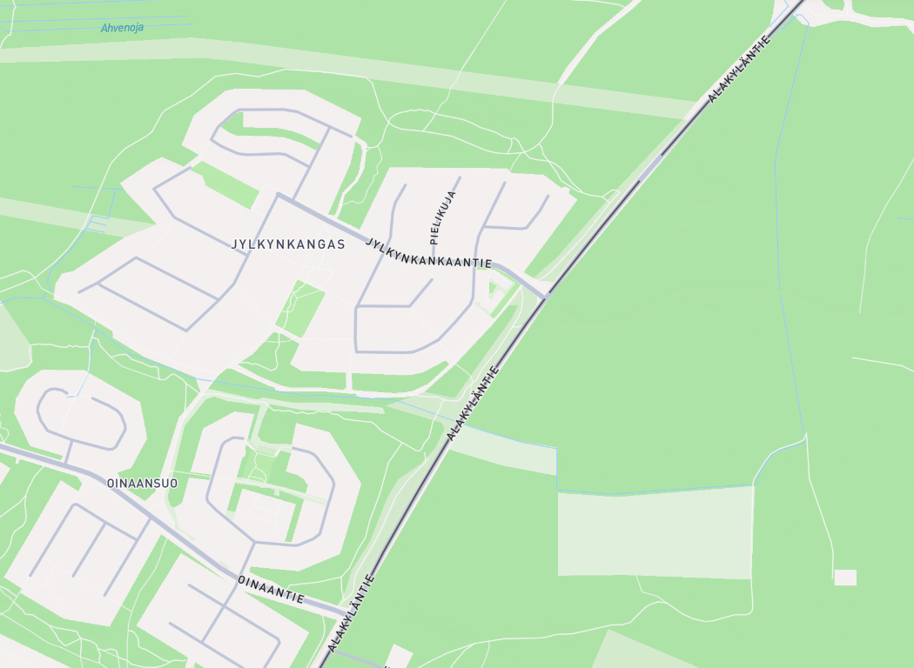
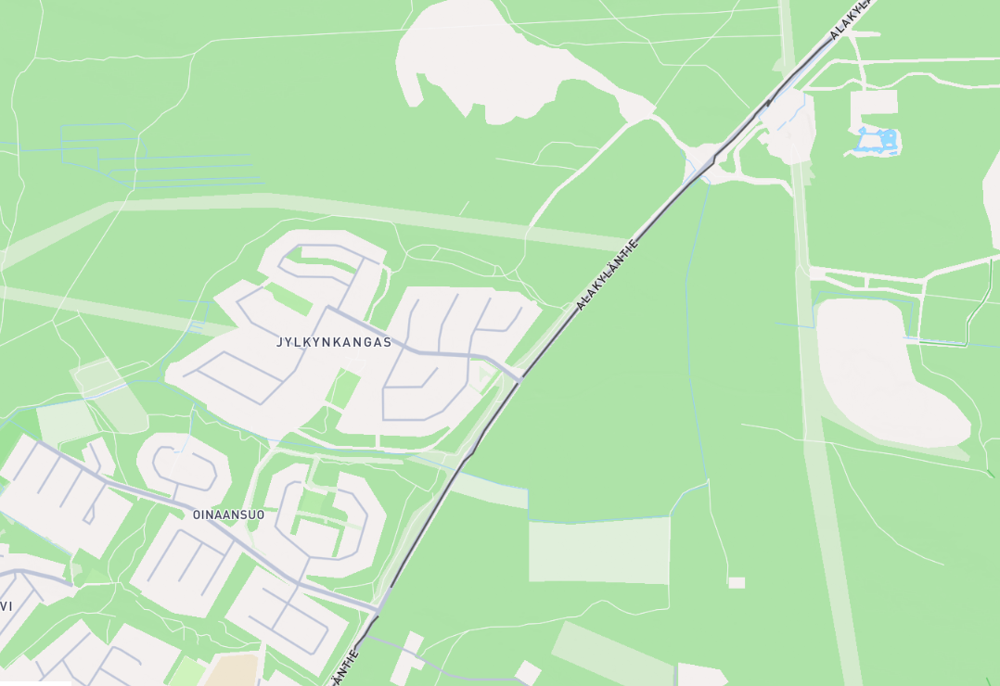
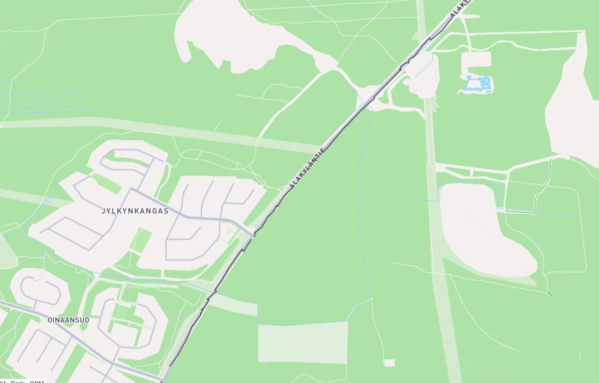
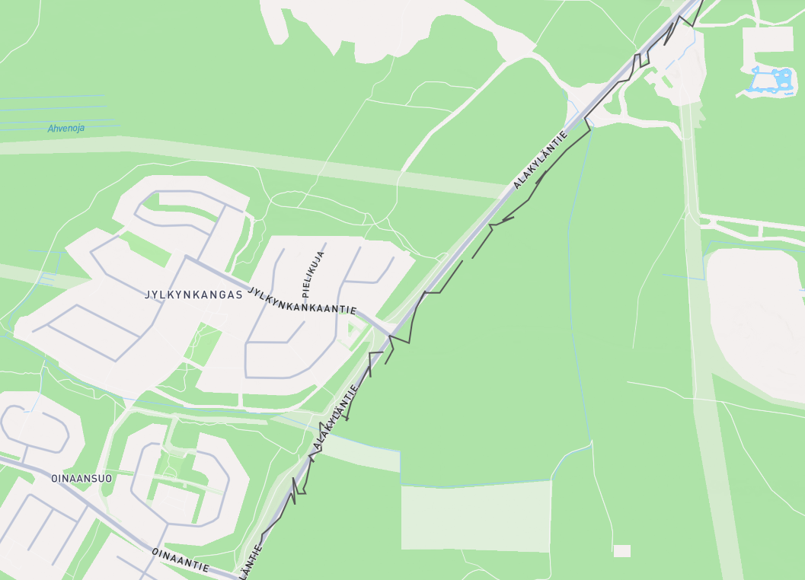
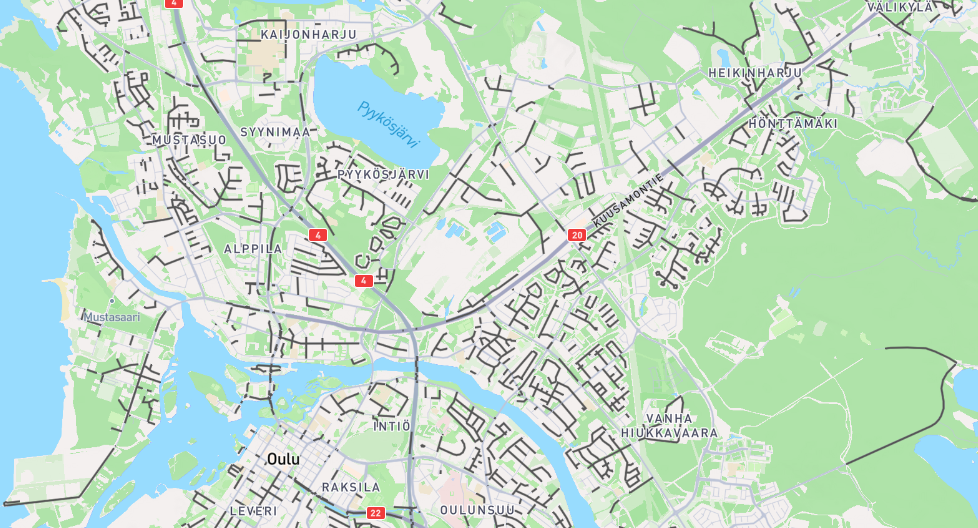
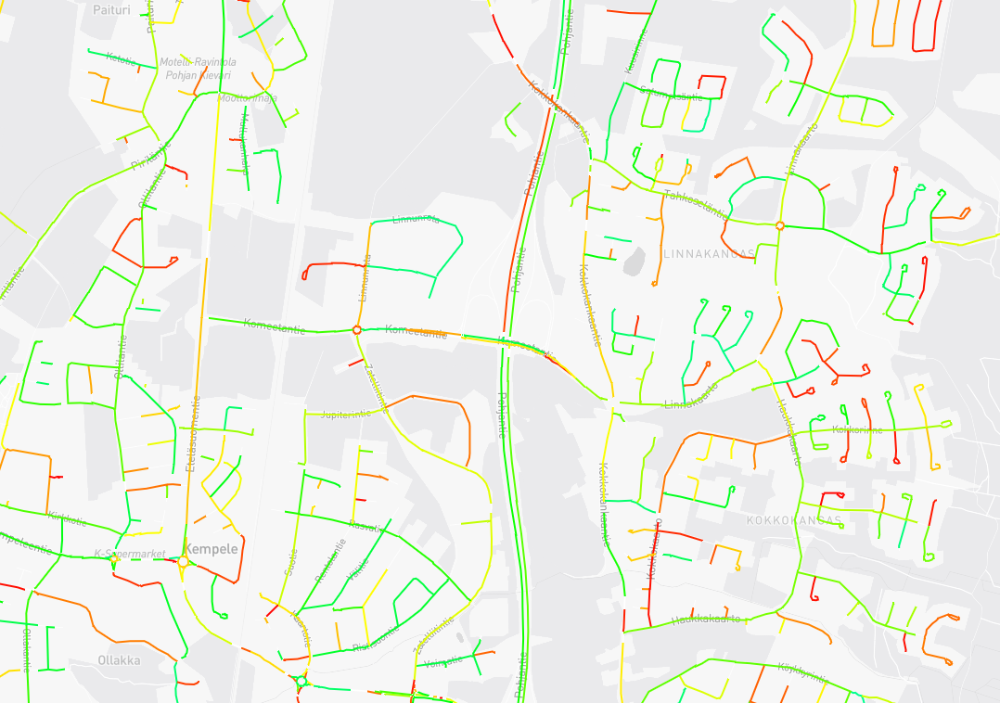

# Generating mock data

**This document is originally from the `api_testing` directory.
The original document will not receive any more updates.**

Atte Oksanen, 11.3.2024

## General

This document outlines a method for creating plow data for testing and proof-of-concept purposes.
The need for this data comes from the segment fitting algorithm,
as it needs a large set of plow data to be fully tested.
This data cannot be collected from the actual API as it is constantly down.

## Methodology

The data is going to be based on the [*OSM Way*](https://wiki.openstreetmap.org/wiki/Way) data,
as these data types share a lot in common.
The plan is to load a set of *Ways* and their coordinates,
and manipulate the data in a way that it can be used as plowing data.

From testing, it seems that the plowing data is about twice as dense as the *Way* data,
and that the coordinate points only have a couple of meters of deviation from the road itself.
The plow routes are also generally way longer than *Ways*.
This would make the data generation a three part process.
First introducing more data points into the *Way* data, then shifting the points under two meters to a random direction,
and finally connecting multiple *Ways* and generating them a timestamp.
After this the program should also transform the data into [GeoJson](https://geojson.org/) for visualization purposes.
For starters, the program will use road segments outlined in `segmentFitTest` for enabling comparisons against real plow data.

## Results

### Success metrics

As the produced data is made for testing purposes, the validation for the outputted data is done by hand.
The data will be exportable to a GeoJson format, which can be visualized at [geojson.io](https://geojson.io/#map=2/0/20).
If the data produced here can interpreted as snow plow data by humans, it means that it can be used for testing.

### First iteration

The program created covers the forementioned processes, except for the *Way* joining,
as it is not needed for visualizing the produced data.
This iteration has two adjustable parameters:
The first is called `shiftAmount` which controls the maximum amount of shifting that the datapoints can do.
This value can be anything over 0, but values around 1 tend to create the best results.
The second is called `shiftProb` which controls how likely it is for a single data point to move.
This value has to be between 0 and 1.

#### Examples

|</img>|
|:--:|
|Real plow data from the City of Oulu \| Route rendered at [geojson.io](https://geojson.io/#map=2/0/20)|

|</img>|
|:--:|
|*Way* data without manipulation \| Route rendered at [geojson.io](https://geojson.io/#map=2/0/20)|

|</img>|
|:--:|
|Simulated data with `shiftAmount = 1` and `shiftProb = 0.2` \| Route rendered at [geojson.io](https://geojson.io/#map=2/0/20)|

|</img>|
|:--:|
|Simulated data with `shiftAmount = 1` and `shiftProb = 1` \| Route rendered at [geojson.io](https://geojson.io/#map=2/0/20)|

|</img>|
|:--:|
|Simulated data with `shiftAmount = 4` and `shiftProb = 1` \| Route rendered at [geojson.io](https://geojson.io/#map=2/0/20)|

### Second iteration

The second iteration included a third parameter, `plowRatio`.
As the dataset was exponentially larger thanks to the discovery of the [Overpass-API](https://wiki.openstreetmap.org/wiki/Overpass_API),
there was a need to limit the amount of roads that were going to be "plowed".

|</img>|
|:--:|
| Simulated data set with `plowRatio = 0.4` \| Rendered at [geojson.io](https://geojson.io/#map=2/0/20)|

### Third iteration

In this iteration, a timestamp was added to the generated data, making the data structurally exactly the same as the real data.
A new parameter was introduced in the form of `timeWindow`, which controls the time window wherein the timestamps are generated.
In addition to this, the road segments are sorted by their center point latitude.
This causes the "plowed" segments to pile up into a single horizontal slice,
which increases the density of the data in the slice without creating extremely large amounts of it.

|</img>|
|:--:|
| Batched, sorted, and timestamped data \| Rendered at [geojson.io](https://geojson.io/#map=2/0/20)|
