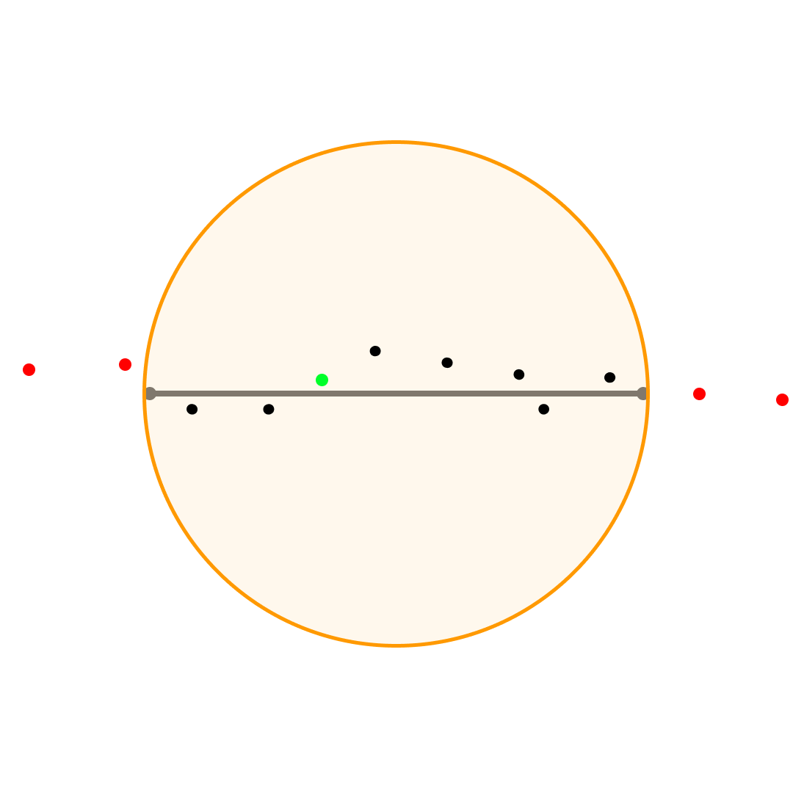
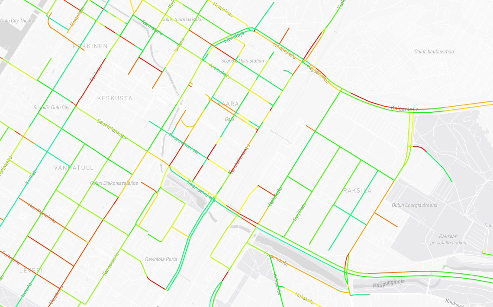

# Raw coordinate to road segment formatting

**This document is originally from the `api_testing` directory.
The original document will not receive any more updates.**

Atte Oksanen, 11.3.2024

## General

As the developed ontology moves away from a raw coordinate based approach on creating actionable knowledge to a segment based approach,
a problem arises from segmenting the data for the graph input.
In this document I will outline a technique for fitting the raw data to a segmented form.
The data to create these segments is provided by OpenStreetMap Foundation under [ODbl-licence](https://opendatacommons.org/licenses/odbl/) ([API-reference](https://wiki.openstreetmap.org/wiki/API_v0.6)).
The snowplow data is provided by the City of Oulu under [Creative Commons Attribution 4.0](https://creativecommons.org/licenses/by/4.0/deed.en).

<div style="page-break-after: always;"></div>

## Premise

### Snowplow route

|</img>|
|:--:|
|Route from Kaijonranta to Alakylä \| Route rendered at [geojson.io](https://geojson.io/#map=2/0/20)|

A route from Kaijonranta to Alakylä exists in the test data set.
The goal is to match this route to the forementioned segments to enable us to query for information reliably inside the Neo4j graph.
The data is in [GeoJSON-format](https://geojson.org/), which is already at the highest possible fidelity, as in raw coordinates.
This route can be found from the test data with an id of "83967738:1705565985".

### OSM Ways

[*OSM Way*](https://wiki.openstreetmap.org/wiki/Way) is a collection of [*Nodes*](https://wiki.openstreetmap.org/wiki/Node).
The OSM API provides data only on a high abstarction level, meaning that when querying for *Ways*, the API returns only the IDs of the *nodes* contained within.
An importer has been built to enrich this data to achieve the fidelity needed for this procedure; I.e. to contain raw coordinates.

The collection of these *Ways* was done by hand, as there is not a known reliable way of querying specific routes from the OpenStreetMap API.

The list starts from the southernmost point in the plow route and covers only the distance of the plow route.

`138924448 => 138924453 => 13892445 => 767687312 => 35374692 => 183631023 => 183631031 => 194745966 => 194745973 => 194690879 => 298592222 => 195007772 => 298592221 => 26127833`

<div style="page-break-after: always;"></div>

### Comparable segment for false positive testing

This *Way* (picture below, id: 22463086) was picked for its geometric similarities and geographic closeness to the target route.
This route can be used to check that the outlined process does not produce false positives on a very rudimentary level.

|</img>|
|:--:|
|*OSM Way* on Takatalontie \| &copy; OpenStreetMap|

<div style="page-break-after: always;"></div>

## Methodology

The plan is to use a mixture of geospatial functions from [Geolib](https://www.npmjs.com/package/geolib) and statistical analysis,
reminiscent of [map matching](https://en.wikipedia.org/wiki/Map_matching), to determine if a *Way* can be marked as plowed.
The basis of this approach comes from the assumption that, if an *OSM Way* is tranformed into a line segment array containing coordinates,
distance calculations between the plow data points and the line segments can be done.
And if all, or enough of these line segments are in extremely close proximity to a coordinate point within the plow data, the *Way* as a whole can be marked as plowed.

### Example

There is an *OSM Way* that contains `n` amount of nodes.
The line segment array built from this *Way* looks like this: `[node-1, node-2], [node-2, node-3], [node-3, node-4]...`.
The array is `n-1` elements long.

After the array is built, it is looped through.
In the loop, the plow data points are filtered by their distance to the center point of the line segment.
If the plow data point is further from the center point than the halved length of the line segment, it will be filtered out.
This is done to prevent excessive use of expensive calculations further in the algorithm.

After the first filter the remaining points have the distance between them and the line segment's closest point calculated.
If there is a point in the line segment or very near to it, the line segment is considered to be plowed.
If enough line segments within a *Way* can be considered to be plowed, the whole *Way* gets marked.

|</img>|
|:--:|
|A visualization of the filtering and marking process for a single line segment.|

<div style="page-break-after: always;"></div>

## Results

### Success metrics

As the forementioned route is completely plowed, the plow ratio of the test segments should be 100%.
For the false positive check the ratio should always be 0%.

### First iteration

The program created from the theory provided in this document proved to be possibly the correct solution for fitting the snowplow data into the road segments.
The program can be tweaked with two parameters: maximum allowable distance to the line, and the ratio of plowed line segments compared to unplowed.
The test data reached 100% plow ratio with the max line distance set to 1.5 meters and the ratio to 0.55,
meaning that the point that marked the line segment plowed has to be closer than 1.5 meters from the line segment,
and 55% of all line segment within a *Way* must be plowed to mark the whole *Way* plowed.
With one case for false positives the program passed the test.
Right now the program measures plowed line segments with only a counter,
but it does not consider the fact that the line segments have different lengths and that the *Way*-elements have a different amount of line segments in them.
This could be fixed by calculating the plow-ratio based on the distance of the line segments.
Also finding or simulating plow data in a more dense area might yield more telling results as there would be a higher possibility of finding closer false positives.

```CL
Maximum distance to line segment: 1.5
Minimum ratio of unplowed line segments: 0.55
Total amount of segments in data set: 13
Segments marked as plowed in the result set: 13
Ratio of plowed road segments to unplowed segments 1
False positive check: passed
```

### Second iteration

The program was modified to consider the differences in line segments by calculating the plowed to unplowed ratio by distance.
This seemed to improve reliability, as smaller segments have a smaller chance of finding a point right near them,
their weight in the final ratio calculations could be decreased.
This fix allowed the ratio parameter to be tweaked to 0.8.
It would seem logical to tweak this approach in a way which would bring the ratio parameter closer to 1 as this would in turn decrease the odds of creating false positives.

```CL
Maximum distance to line segment: 1.5
Minimum ratio of unplowed line segments: 0.8
Total amount of segments in data set: 13
Segments marked as plowed in the result set: 13
Ratio of plowed road segments to unplowed segments 1
False positive check: passed
```

<div style="page-break-after: always;"></div>

### Third iteration

The program was optimized by putting the plow data points into buckets by their longitudal coordinate (truncated to two decimals),
instead of looping through the entire data set.
This reduced the required amount of loops by 88%.

#### Before optimization

```CL
Maximum distance to line segment: 1.5
Minimum ratio of unplowed line segments: 0.8
Total amount of segments in data set: 13
Segments marked as plowed in the result set: 13
Total amount of nodes in data set: 150
Total amount of loops done: 23541
Loops per node: 156
Ratio of plowed road segments to unplowed segments 1
False positive check: passed
```

#### After optimization

```CL
Maximum distance to line segment: 1.5
Minimum ratio of unplowed line segments: 0.8
Total amount of segments in data set: 13
Segments marked as plowed in the result set: 13
Total amount of nodes in data set: 150
Total amount of loops done: 2877
Loops per node: 19
Ratio of plowed road segments to unplowed segments 1
False positive check: passed
```

<div style="page-break-after: always;"></div>

#### Full set of plow data

So far the tests have been conducted with data points only from a single plow route.
When testing for the whole data set, the amount of unique coordinate points rose from 289 to 7161.
Without modifications, the program needed 129 loops per node when before it was only 19.
The program was optimized by increasing the fidelity of the bucketing operation.
As can be seen in the table below, increasing the amount of decimals concidered for bucketing improves efficiency to 5 decimals until plateauing completely. This platea occurs as there are quite rarely any more than 5 decimals in a coordinate point.
This causes problems, as the data is so fragmented that the line segments cannot find the closest points and start to lose accuracy.
When the bucketing operation is ran with no truncating, the segments cannot find any points,
as each bucket only contains one data point.

| Number of decimals | Loops per node | Segment plow ratio (should be 1)|
|:--|:--|:--|
|2| 129|1|
|3| 59|1|
|4| 52|1|
|5| 51|0.85|
|6| 51|0.85|
|7| 51|0.85|
|no truncating|48|0|

Interestingly, there is a lot of duplicate coordinate pairs within the test data,
as over 94% of the coordinate pairs are overlapping.
The cause of this might be a fitting operation done before publishing the data.
This has no foreseeable negatives when it comes to this project,
but it is important to concider, when discussing the amount of data in different points in the system.

<div style="page-break-after: always;"></div>

### Fourth iteration

**NOTE: This iteration relies heavily on the findings made in `segment_polling.md` and `generating_mock_data.md`**

This iteration did not include any new functionality to the linking algorithm,
but focused solely on benchmarking and analysing the program to find deficiencies.
With the advancement of the segment poller and the mock data generator, more comprehensive testing could be done.

Now that the program can be tested on mock data,
extracting information on the validity of the program's choices was made possible.
The most important metrics below are `Ratio of marked plowed road segments to plowed road segments`
and `Ratio of false positives to marked road segments`.
The first metric tells how much of the actually plowed roads were found and linked,
and the second metric tells how much of these linked roads were not actually plowed.
As can be seen below, the program found 96% of all plowed roads, and only 3% of these were falsy.

```CL
Maximum distance to line segment: 1.5
Minimum ratio of unplowed line segments: 0.8
Total amount of segments in data set: 8241
Total amount of nodes in data set: 66795
Total amount of loops done: 3900580
Loops per node: 58
Segments marked as plowed in the result set: 2377
Plowed roads in mock data: 2472
Ratio of marked plowed road segments to plowed road segments 0.9615695792880259
False positives created in fitting: 81
Ratio of false positives to marked road segments: 0.0340765671013883
Milliseconds taken by fitting: 7393
Milliseconds per node 0.1106819372707538
```

<div style="page-break-after: always;"></div>

#### Testing with real data

Just as the mock data generator had reached an acceptable level of imitation, the API from the City of Oulu started working again.
It is still extremely unreliable so the work done to create mock data was not in vain.
When testing against real data. The linking parameters had to be tweaked, as the density of the data points was reduced on roads with high speed limits.
The max line distance was set to 6 meters and the ratio to 0.4.
The max line distance parameter was set according to the finnish road widths (image below).

|</img>|
|:--:|
|Finnish road widths \| Data from [fi.wikipedia.org/wiki/Suomen_tieverkko](https://fi.wikipedia.org/wiki/Suomen_tieverkko)|

<div style="page-break-after: always;"></div>

|</img>|</img>|
|:--:|:--:|
|Real plow data from the City of Oulu \| Rendered at [geojson.io](https://geojson.io/#map=2/0/20)| Road segments marked as plowed \| Rendered at [geojson.io](https://geojson.io/#map=2/0/20)|

The color of the rendered lines represent the time of plowing related to other routes in the data set.
The greenest ones are the newest.
As can be seen from these renders, they are very similar meaning that the linking algorithm works quite well.
The linker did not miss any segments,
but the plowed segment northeast from Kiiminki is a few hundred meters longer than the plow route.
This is caused by the road segments itself as the segment is longer than the plow route.

<div style="page-break-after: always;"></div>

#### Mock data renders

The color of the rendered lines represent the time of plowing related to other routes in the data set.
The green lines are the newest, and red lines the oldest.

|</img>|</img>|
|:--:|:--:|
|Generated mock data \| Rendered at [geojson.io](https://geojson.io/#map=2/0/20)| Plowed road segments \| Rendered at [geojson.io](https://geojson.io/#map=2/0/20)|

|</img>|</img>|
|:--:|:--:|
|Generated mock data closeup \| Rendered at [geojson.io](https://geojson.io/#map=2/0/20)| Plowed road segments closeup \| Rendered at [geojson.io](https://geojson.io/#map=2/0/20)|

|</img>|</img>|
|:--:|:--:|
|Generated mock data in a high road density area \| Rendered at [geojson.io](https://geojson.io/#map=2/0/20)| Plowed road segments in a high road density area \| Rendered at [geojson.io](https://geojson.io/#map=2/0/20)|

<div style="page-break-after: always;"></div>

## List of possible edge cases

### Multilevel intersections

|</img>|
|:--:|
|Kuusamontie-Pohjantie intersection \| &copy; OpenStreetMap|

Multilevel intersections with multiple lanes can prove to be tricky to manage, as in these positions,
the plow data might look more like a point cloud rather than points ordered in distinctive lines.
For this intersection in particular, the ramps are not marked as *Ways*, so the data from the graph would be anyways somewhat incomplete.
The problem might be fixed with the forementioned tweak of using distance instead of count when determening if a *Way* is plowed.
In terms of distance, these specialty sections are very short, but ramps are also known for being more accident prone than other road sections,
so overall impact is difficult to predict.
To mitigate the risk from this case, some data on intersections has to be found or simulated to test the current program iteration against it.

<div style="page-break-after: always;"></div>

|</img>|</img>|
|:--:|:--:|
|Plow data on a ramp in a multilevel intersection \| Rendered at [geojson.io](https://geojson.io/#map=2/0/20)| Plowed road segments in the same intersection \| Rendered at [geojson.io](https://geojson.io/#map=2/0/20)|

As can be seen from the pictures above,
the linker does not recognize the ramps and also determines that the northern lane of Oulunlahdentie is plowed.
The first problem is caused by the linker not having access to the ramp segments.
This was a conscious choise, as the geometry of the ramps is vulnerable to false positives because it is short and round.
The second problem is caused by the lack of height information in the segment and plow data.
These issues do not require further action, as they do not hinder the usefulness of the data in a meaningfull way.

<div style="page-break-after: always;"></div>

### Separated lanes

|</img>|
|:--:|
|Bertel Jungin tie \| &copy; OpenStreetMap|

Roads with separated lanes might cause false positives.
The reason is that if a plow route is tracked to the very center of the road, it might "snap" to the other lane.
With roads that have the lanes together possibly have a higher chance of getting both lanes plowed very shortly one after another,
but on roads with separated lanes the plowing might be done in a more linear way, as turning around is usually harder.
This case cannot be mitigated by improving the software used, as the problem lies within the data and the physical activity of plowing these roads.
This problem would only occurr very intermittently, as the data collection timing would have to fit in the time window before the other lane is also plowed.

|</img>|</img>|
|:--:|:--:|
|Generated mock data in a high road density area \| Rendered at [geojson.io](https://geojson.io/#map=2/0/20)| Plowed road segments in a high road density area \| Rendered at [geojson.io](https://geojson.io/#map=2/0/20)|

As can be seen from the pictures above, especially Kajaanintie in the top right corner,
the separated lanes do not cause issues.
