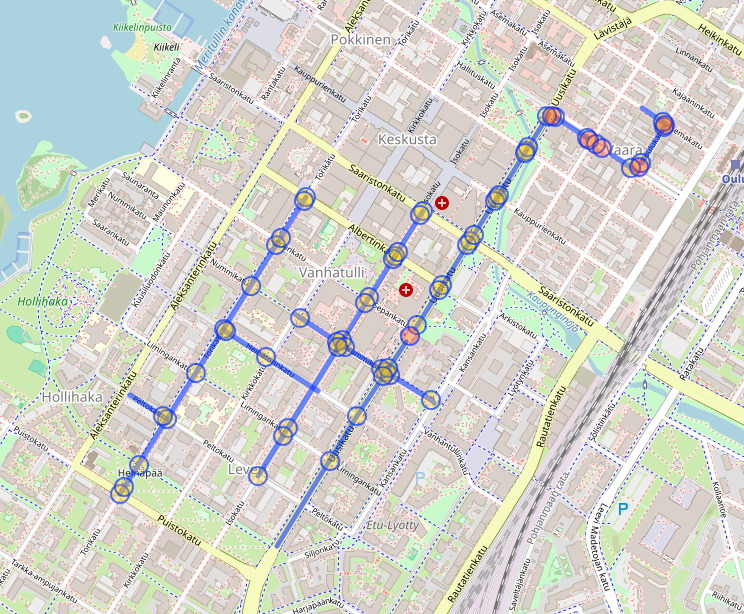

# Routing for testing the knowledge graph

Atte Oksanen, 11.3.2024

## General

As the data for the knowledge graph (KG) starts to take its final shape,
it is imperative to create ways for testing the final iteration of the software.
Even though routing is not an expected deliverable of this project,
it does provide essential tooling to test the KG.

## Methodology

The plan is to use the [Open Source Routing Machine](https://project-osrm.org/) (licenced under [2-Clause BSD License](https://opensource.org/license/bsd-2-clause)) to create the wanted route,
and then using the [Overpass API](https://overpass-api.de/) (licenced under [ODbL licence](https://opendatacommons.org/licenses/odbl/1-0/)) to get the *[Way](https://wiki.openstreetmap.org/wiki/Way)*-elements that the route crosses
which share id-attributes with our RoadSegment-elements.

## Results

The implementation works in three phases.
The function takes an array of coordinate pairs,
outlining the wanted route.
The coordinate pairs are used to create a request,
that is sent to the OSRM-API.
The API responds with a list of *[Nodes](https://wiki.openstreetmap.org/wiki/Node)* that make up the route.
Then a request is made to the Overpass-API for *Way*-elements with the nodes received before as parameters.
The Overpass API responds with the *Way*-elements that contain the forementioned *Nodes*.
Then the function filters out all of the *Way*-elements that are not used in the route and returns the rest.
The filter works in a way where it filters out the *Way*-elements that do not include more than one nodes from the route.

|</img>|
|:--:|
|Route from OSMR viewed in [OpenStreetMap client](https://www.openstreetmap.org/) \| &copy; OpenStreetMap|

|</img>|
|:--:|
|*Way*-elements before filtering  \| Rendered with [Overpass Turbo](https://overpass-turbo.eu/#)|

|</img>|
|:--:|
| *Way*-elements after filtering  \| Rendered with [Overpass Turbo](https://overpass-turbo.eu/#)|
