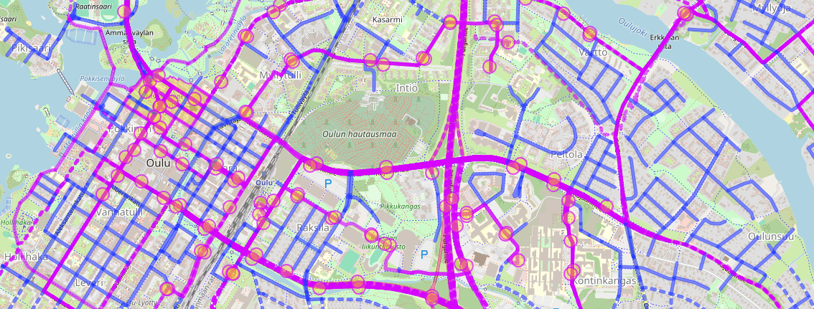

# Road segment polling

**This document is originally from the `api_testing` directory.
The original document will not receive any more updates.**

Atte Oksanen, 5.3.2024

## General

As the tools for creating mock plow data and fitting it to the road segments start to be concretized,
there is still a question that has been intentionally unanswered before.
How to get the road segment data?
So far the forementioned tools have used a more manual way of collecting data,
where indivudual [*OSM Ways*](https://wiki.openstreetmap.org/wiki/Way) are picked by hand and then queried.
This limits the scope of creating the mock data, as it is based on the segment data,
and therefore also limits the testing of the fitting tool.
This document will outline the methodology to gather the needed data.

<div style="page-break-after: always;"></div>

## Data source - Overpass

|</img>|
|:--:|
| OSM data visualized \| Rendered with [Overpass turbo](https://geojson.io/#map=2/0/20)|

[Overpass](https://wiki.openstreetmap.org/wiki/Overpass_API) is a read only API for the OpenStreetMap database.
Unlike the OSM-API, which requires multiple requests to fully enrich the data,
the Overpass API can be queried once, with its [OverpassQL](https://wiki.openstreetmap.org/wiki/Overpass_API/Overpass_QL)-querying language, and receive all of the data.
The data can be visualized with [Overpass turbo](https://overpass-turbo.eu/); a service reminiscent of [Apollo sandbox](https://www.apollographql.com/docs/graphos/explorer/sandbox/).

### Positives

- The data is the same as used before.
  - Requires very minor tweaking to the already made tools.
- The fidelity is just right.
  - The data shows roads, and physically separated lanes, same as the plowing data.
- The data size is manageable.
  - The data shown in the picture above is only about 4MB, and for the City of Oulu area, it is only a bit over 10MB.
- The data is not in a file.
- The data can be queried with a EPSG 4326 bounding box.

### Negatives

- The data is gathered by the users of OSM, so full concistency to actual geography is not promised.

<div style="page-break-after: always;"></div>

## Conclusions

For now, it seems that the Overpass API is just the data source needed for this use case.
Full compatibility with tooling has been reached on 5.3.2024.

### OverpassQL query

The data visualized in the image above was fetched with the query below.

The first argument `out` defines the output format of the data.
Then the parameter `way` defines that the queried object is an *OSM Way*.
The parameters in square brackets define, that the *Way* must have a `highway` tag,
and that the tags value must be match the RegEx.
This will filter out all non road *Ways*.
The final square bracket filters the *Ways* to exclude all bicycle only roads (Kevyen liikenteen väylä).
The arch brackets define a bounding box for the query.
This bounding box covers most of the City of Oulu.
The `(._;<;);` is a sign of downwards recursion.
As the *Ways* do not include coordinates, the *Nodes* that make up them, must be included.
The final line limits the geometry to the same bounding box as used in the query.
If the geometry is not limited, it would feature a lot of data outside the bounding box.

```OQL
[out:json];
(
  way["highway"]["highway"~"^(unclassified|trunk|motorway|primary|secondary|tertiary|residential)$"]["bicycle"!="designated"](64.7,25.2486,65.1968,25.9491);
  <;
);
(._;<;);
out geom(64.7,25.2486,65.1968,25.9491) body;
```
