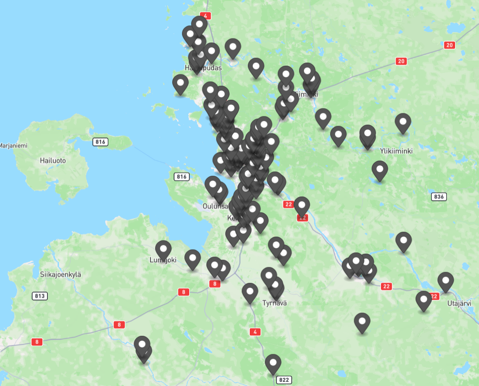

# Weather forecast polling

Atte Oksanen, 20.3.2024

## General

After succesfully intergrating all previous sources of data,
it has become apparent that the data fidelity in our knowledge graph (KG) can be substantially increased.
The increase in data amount and variety would increase the value provided by the KG,
even possibly revealing options to create fully derivative data housed within the KG.
Currently there are over 11100 road segments used in our system and only 9 of them can even have weather data linked to them.

## Methodology

The plan is to use the [FMI Open Data API](https://en.ilmatieteenlaitos.fi/open-data-manual) to poll weather data based on road segment coordinates.
The ground work for this was already done during the creation of the `RoadSegment`-objects as an attribute named `centerPoint` was added.

## Implementation / Results

The data integration is fairly straightforward,
only consisting of an XML-to-JSON transformation,
and then some data filtering and sorting to get it into a more readable format.
The data polling can be controlled by a single parameter called `dataRatio`,
which limits the amount of segments being used for polling.

```JSON
"ForecastData": [ //Highest level is an array of polled segments
    {
      "segmentId": 813808342,
      "forecasts": [{ //Each segment gets forecasts for the next 36 hours
        "time": 1710964800,
        "temperature": -0.8,
        "precipitation": 0,
        "precipitationPerHour": 0,
        "precipitationType": "snow",
        "windSpeed": 3.04,
        "windDirection": 17.24
      }]
    }
  ]
```

|</img>|
|:--:|
| Forecast points rendered with `dataRatio = 0.1` \| Rendered at [geojson.io](https://geojson.io/#map=2/0/20)|
