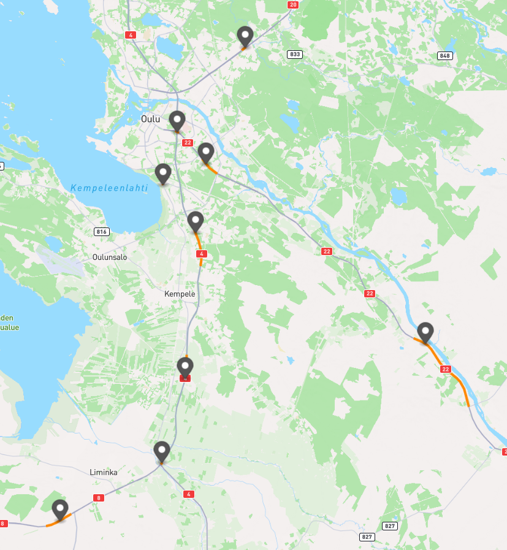

# Weather station linking

Atte Oksanen, 5.3.2024

## General

This document outlines a method used for linking the FMI's weather stations to the *RoadSegment*-elements withing the knowledge graph.
The geospatial and mathematical basis for linking this data is very similar to the linking of the plow data,
discussed in `plow_data_linking.md`,
so there will not be any theory in this document.

## First iteration

The program uses a less complicated linking algorithm compared to the plow data linker,
because there are currently only nine weather stations.
The parameter `DISTANCE_LIMIT = 9` was used for this iteration of the program.
As can be seen from the picture below, the program has achieved 100% success rate on the provided data set.

|</img>|
|:--:|
|All of the provided weather stations and the linked roads. \| Route rendered at [geojson.io](https://geojson.io/#map=2/0/20)|
